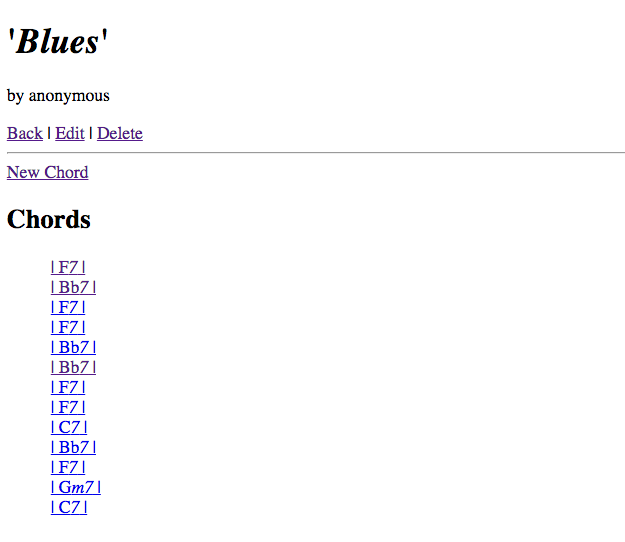

# chord_changes
By [Scott Macpherson](https://github.com/scottmacphersonmusic)
### Description
**chord_changes** is a small app designed to illustrate two models sharing `belongs_to` and `has_many` associations with one another.
### New Feature!
Creating, updating and deleting songs has been AJAXified!  Behold the magnificence!
### Screenshot

### Usage
Create, edit and delete songs.  By viewing a given song you will be shown its chords - to view the chords individually, click on a chord name.
### Credit
- Brook Riggio, Kevin Townsend and Mary Dickins were instrumental in pulling this app together.
